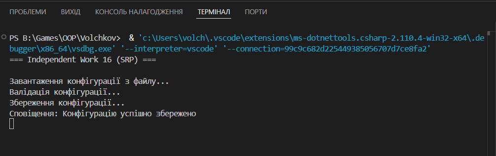

# Самостійна робота №16  
## Тема: Схема розподілу відповідальностей модуля (SRP)

### Мета роботи
Навчитися застосовувати принцип єдиної відповідальності (Single Responsibility Principle, SRP)  
для декомпозиції складного модуля на окремі класи з чітко визначеними обов’язками,  
а також використати принцип інверсії залежностей (DIP).

---

## Опис завдання
У роботі реалізовано приклад модуля **ConfigurationManager**, який порушує принцип SRP,  
оскільки виконує декілька відповідальностей одночасно:
- завантаження конфігурації;
- валідація;
- збереження;
- сповіщення про зміни.

Після цього виконано рефакторинг з розділенням відповідальностей між окремими інтерфейсами  
та класами.

---

## Структура рішення
Для спрощення демонстрації всі класи та інтерфейси реалізовані **в одному файлі `Program.cs`**.

### Основні компоненти:
- **ConfigurationManager** – приклад «поганого» класу з порушенням SRP;
- **IConfigLoader** – інтерфейс завантаження конфігурації;
- **IConfigValidator** – інтерфейс валідації;
- **IConfigSaver** – інтерфейс збереження;
- **IChangeNotifier** – інтерфейс сповіщення;
- **ConfigurationService** – основний сервіс, що координує роботу компонентів.

Залежності передаються через інтерфейси, що відповідає принципу інверсії залежностей (DIP).

---

## Технології
- Мова програмування: **C#**
- Платформа: **.NET**
- Тип проєкту: **Console Application**

---

## Приклад роботи 