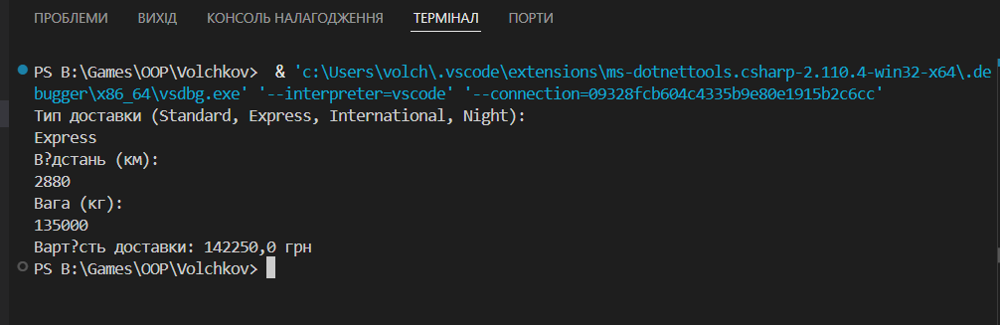

# Лабораторна робота №21 варінат 8
## Реалізація системи розрахунку доставки з використанням OCP

###  Опис рішення
У роботі реалізовано систему доставки з можливістю вибору різних
алгоритмів розрахунку вартості.

#### 1. Інтерфейс `IShippingStrategy`
Описує єдиний метод:
- `CalculateCost(decimal distance, decimal weight)`

#### 2. Стратегії доставки
- **StandardShippingStrategy** – стандартна доставка
- **ExpressShippingStrategy** – експрес-доставка
- **InternationalShippingStrategy** – міжнародна доставка
- **NightShippingStrategy** – нічна доставка (розширення системи)

#### 3. Factory Method
Клас `ShippingStrategyFactory` створює відповідну стратегію на основі
типу доставки, введеного користувачем.

#### 4. DeliveryService
Клас виконує розрахунок вартості доставки та залежить лише від
інтерфейсу `IShippingStrategy`, що відповідає принципу OCP.

###  Дотримання Open/Closed Principle
Для додавання нового типу доставки (`NightShippingStrategy`) не було
змінено логіку класу `DeliveryService`. Система розширюється шляхом
додавання нового класу стратегії.

###  Приклад роботи програми 
1. Користувач вводить тип доставки
2. Вводить відстань та вагу
3. Програма розраховує та виводить вартість доставки

### Висновок
У ході лабораторної роботи було реалізовано гнучку систему доставки,
яка відповідає принципам об’єктно-орієнтованого програмування та OCP.
