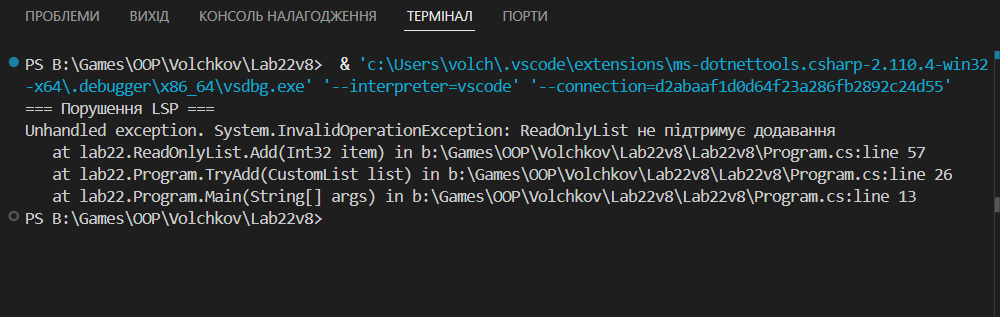

# Лабораторна робота №22 варіант 8

## 1. Початкова ієрархія (порушення LSP)

Було реалізовано базовий клас `CustomList`, який має метод `Add(item)`.
Клієнтський код очікує, що будь-який об’єкт цього типу підтримує додавання елементів.

Похідний клас `ReadOnlyList` наслідує `CustomList`, але перевизначає метод `Add`
та викидає виняток.

### Проблема
Це порушує принцип підстановки Лісков, оскільки об’єкт `ReadOnlyList`
не може коректно замінити об’єкт `CustomList`.

### Порушений контракт
- Базовий клас гарантує можливість додавання елементів
- Похідний клас цю гарантію порушує
- Клієнтський код ламається під час виконання

## 2. Альтернативне рішення (дотримання LSP)

Було застосовано підхід **зміни ієрархії** з використанням інтерфейсів.

### Нова структура
- `IReadOnlyList` — лише читання
- `IWritableList` — читання + додавання
- `WritableList` реалізує `IWritableList`
- `SafeReadOnlyList` реалізує `IReadOnlyList`

### Переваги
- Кожен клас реалізує тільки дозволену поведінку
- Клієнтський код не викликає заборонені методи
- LSP дотримано на рівні типів

## Приклад роботи програми 

## 3. Висновки

Принцип LSP є критично важливим для безпечного використання наслідування.
Неправильна ієрархія може призвести до помилок часу виконання.
Використання інтерфейсів дозволяє чітко зафіксувати контракт
та уникнути порушення LSP.
