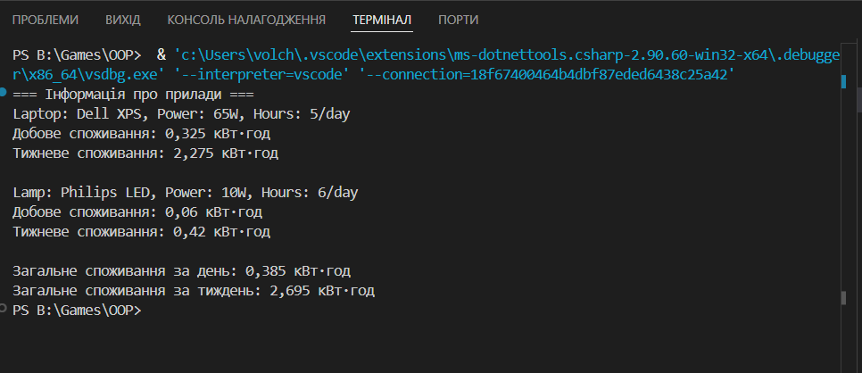

# Lab 4: Прилади

## Тема
Інтерфейси, абстрактні класи, композиція.

## Мета
Навчитися створювати абстрактні класи та інтерфейси, реалізовувати їх у похідних класах, застосовувати композицію.

## Виконання
- Створено інтерфейс `IPowerUsage` з методами:
  - `GetDailyConsumption()`
  - `GetWeeklyConsumption()`
- Створено абстрактний клас `Device` з базовими властивостями (`Name`, `Power`, `HoursPerDay`).
- Реалізовано два класи:
  - `Laptop`
  - `Lamp`
- Використано композицію: список `List<Device>` містить різні об’єкти.
- Продемонстровано підрахунок споживання електроенергії.

## Приклад запуску 
=== Iнформацiя про прилади ===
Laptop: Dell XPS, Power: 65W, Hours: 5/day
=== Iнформацiя про прилади ===
Laptop: Dell XPS, Power: 65W, Hours: 5/day
Laptop: Dell XPS, Power: 65W, Hours: 5/day
Добове споживання: 0,325 кВт·год
Тижневе споживання: 2,275 кВт·год

Lamp: Philips LED, Power: 10W, Hours: 6/day
Добове споживання: 0,06 кВт·год
Тижневе споживання: 0,42 кВт·год

Загальне споживання за день: 0,385 кВт·год
Загальне споживання за тиждень: 2,695 кВт·год

## Контрольні запитання 

 ## 1. У чому різниця між абстрактним класом і інтерфейсом?

Абстрактний клас може мати як реалізацію методів, так і абстрактні методи.

Інтерфейс містить лише сигнатури методів/властивостей (контракт), без реалізації.

Клас може успадковувати тільки один абстрактний клас, але реалізовувати багато інтерфейсів.

## 2. Коли краще використовувати композицію, а коли наслідування?

Наслідування — коли об’єкт є різновидом іншого (Book є Product).

Композиція — коли об’єкт складається з інших (Order має список Product).

## 3. Як працює агрегація та чим вона відрізняється від композиції?

Агрегація — "слабкий" зв’язок: об’єкт може існувати без іншого.
(Наприклад. School має Teacher, але вчитель може існувати і без школи).

Композиція — "сильний" зв’язок: частини не існують окремо.
(Наприклад. Car має Engine — двигун не існує без машини).

## 4. Чи може клас реалізовувати кілька інтерфейсів одночасно?

Один клас може реалізовувати необмежену кількість інтерфейсів.

 ## 5. Для чого в ООП використовують інтерфейси як контракти?

Інтерфейси визначають що клас має робити, але не як саме.
Вони дозволяють будувати гнучкі системи, де різні класи можна використовувати однаково, якщо вони дотримуються одного контракту.