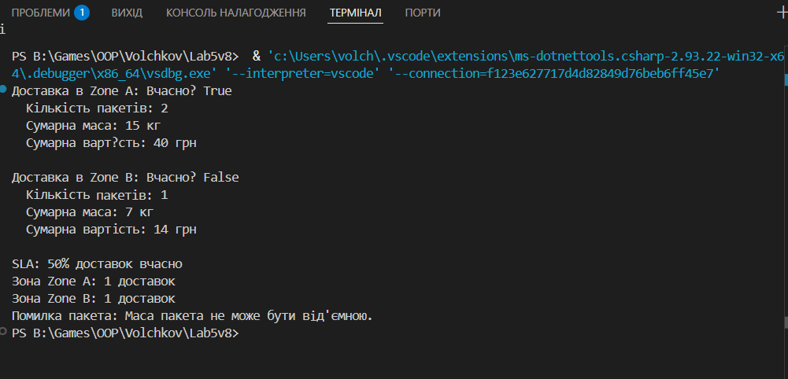

# Lab5v8 — Доставка продуктів (Delivery/Package)
Опис задачі

Цей консольний застосунок моделює доставку продуктів.

Композиція: Клас Delivery містить список Package.

Generics: Використовується Repository<T> для зберігання об’єктів доставки.

Винятки: Контроль від’ємних значень маси та ціни пакета через InvalidPackageException.

Обчислення:

Сумарна маса та вартість доставки

SLA-відсоток вчасних доставок

Групування доставок по зоні

# Створення пакетів та доставок
var package1 = new Package("Яблука", 10, 2.5);
var package2 = new Package("Груші", 5, 3.0);
var package3 = new Package("Банани", 7, 2.0);

var delivery1 = new Delivery("Zone A", true);
delivery1.Packages.AddRange(new[] { package1, package2 });

var delivery2 = new Delivery("Zone B", false);
delivery2.Packages.Add(package3);

var repo = new Repository<Delivery>();
repo.Add(delivery1);
repo.Add(delivery2);

# Приклад запуску 