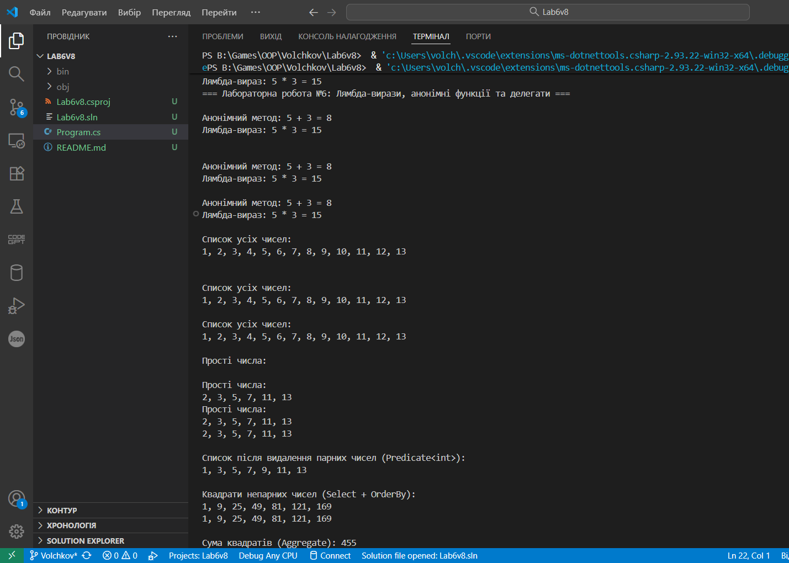

#  Лабораторна робота №6 — Лямбда-вирази, анонімні функції та делегати у C#

##  Загальна інформація
**Дисципліна:** Об’єктно-орієнтоване програмування (OOP)  
**Варіант:** №8  
**Студент:** Волчков Юрій  
**Мета роботи:**  
Закріпити знання про делегати, події, анонімні методи, лямбда-вирази, а також застосування вбудованих делегатів `Func<>`, `Action<>`, `Predicate<>` у C#.  
Отримати практичний досвід роботи з LINQ-запитами для обробки колекцій.

##  Завдання варіанту 8
Реалізувати:
- `Func<int, int, bool>` — для перевірки, чи є число **простим**;
- `Action<List<int>>` — для **друку списку** у консоль;
- `Predicate<int>` — для **видалення непотрібних елементів** (наприклад, парних чисел);
- Виконати **обробку колекції** за допомогою методів LINQ (`Where`, `Select`, `OrderBy`, `Aggregate`).

##  Використані технології
- Мова програмування: **C# (.NET 6 / .NET 7)**
- Колекції: **List<T>**
- Делегати: **Func<>, Action<>, Predicate<>**
- **LINQ**-операції для фільтрації, сортування та агрегації
- Анонімні методи та лямбда-вирази

# Приклад запуску 
