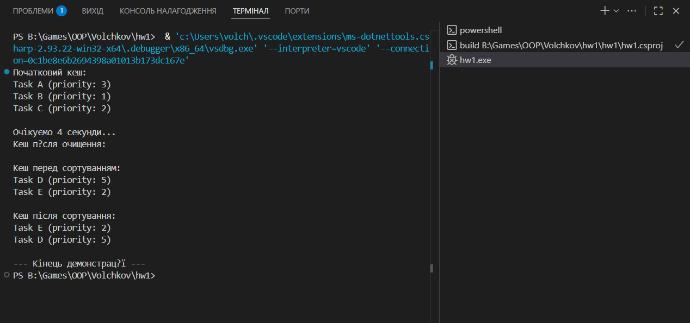

# HW1: Узагальнений кеш `Cache<T>`

###  Мета
Розробити узагальнений кеш із підтримкою:
обмежень типів (`where T : class, new()`);
видалення старих елементів;
сортування без LINQ (алгоритм вставками);
демонстрації роботи через `Program.cs`.

---

###  Структура
 `Cache<T>` — універсальний контейнер для кешування об’єктів;
 `Item` — тестовий клас із властивістю `Priority`;
 `ItemPriorityComparer` — компаратор для сортування;
 `Program.cs` — демонстрація додавання, очищення та сортування.

---

###  # Приклад запуску 
