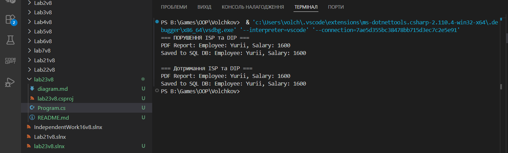

# Лабораторна робота №23
## Принципи ISP та DIP

## 1. Початкова структура (порушення ISP та DIP)

Було реалізовано клас `BadPayrollSystem`, який:
- Сам створює свої залежності
- Використовує конкретні класи:
  - SalaryCalculator
  - PdfExporter
  - SqlDatabase

### Порушення DIP
Модуль вищого рівня (`BadPayrollSystem`) залежить від конкретних реалізацій,
а не від абстракцій. Це створює жорсткий зв’язок та ускладнює розширення.

### Порушення ISP
Клас `BadPayrollSystem` змушений працювати з великими залежностями,
навіть якщо йому потрібна лише частина їх функціональності.

## 2. Рефакторинг

Було застосовано:

### ISP
Виділено вузькі інтерфейси:
- ISalaryCalculator
- IReportExporter
- IDataStorage

Кожен інтерфейс містить лише необхідні методи.

### DIP
Залежності більше не створюються всередині класу.
Вони передаються через конструктор (Dependency Injection).

## 3. Нова структура

- GoodPayrollSystem залежить від абстракцій
- Реалізації можна легко замінювати
- Зменшено зв’язаність
- Система розширювана

## 4. Висновки

Принцип ISP дозволяє уникнути залежності від зайвих методів.
Принцип DIP зменшує зв’язаність між модулями.

## Приклад роботи програми 