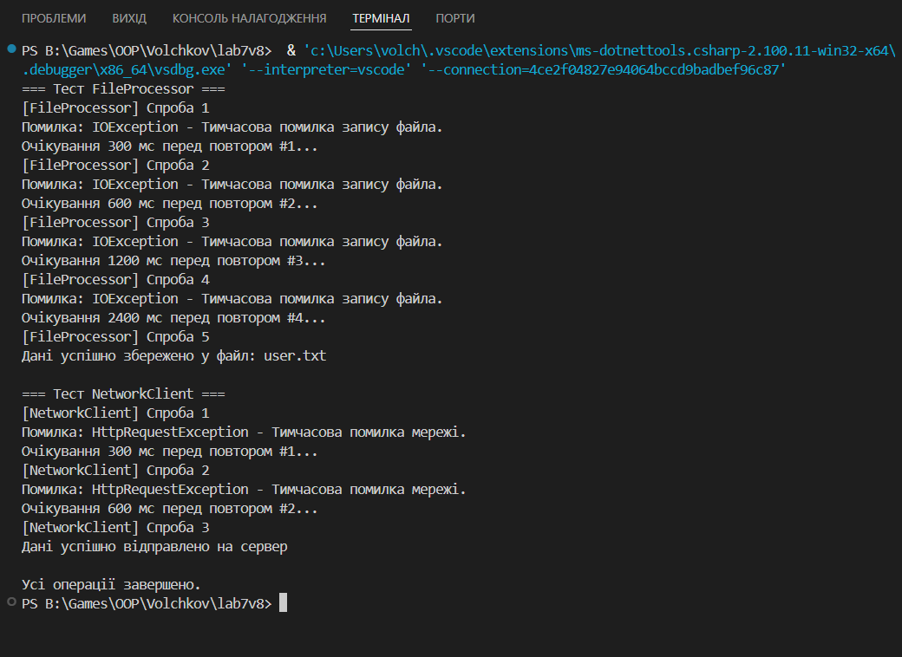

# Мета роботи:
Навчитися створювати класи, що імітують помилки, опрацьовувати виняткові ситуації, а також реалізовувати універсальний механізм повторних спроб виконання операцій (Retry pattern) з використанням делегатів та експоненційної затримки.

Завдання варіанту 8

Реалізувати такі компоненти:

1. # FileProcessor
Метод:
void SaveUserData(string path, string userData)

Поведінка:
перші 4 виклики — кидати IOException;
на 5-й та далі — успішне виконання.

2. # NetworkClient
Метод:
bool PostUserData(string url, string userData)

Поведінка:
перші 2 виклики — HttpRequestException;
далі — успішне виконання.

3. # RetryHelper
Універсальний клас з методом:
public static T ExecuteWithRetry<T>(
    Func<T> operation,
    int retryCount = 3,
    TimeSpan initialDelay = default,
    Func<Exception, bool>? shouldRetry = null)

Має забезпечити:
 1.повторні спроби при помилці;
 2.експоненційну затримку (initialDelay × 2ⁿ);
 3.логування кожної спроби;
 4.можливість вибіркового повтору через shouldRetry.

4. # Функція shouldRetry
Повтор виконувати лише коли трапляються:
IOException
HttpRequestException

5. # Main
У методі Main:
 1.створити об'єкти FileProcessor і NetworkClient;
 2.викликати їх методи через RetryHelper;
 3.показати невдалі спроби та успішний результат.

# Приклад запуску 
